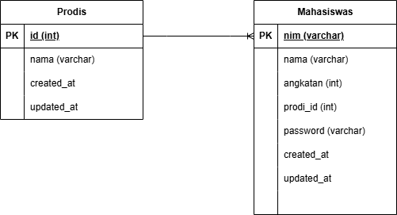
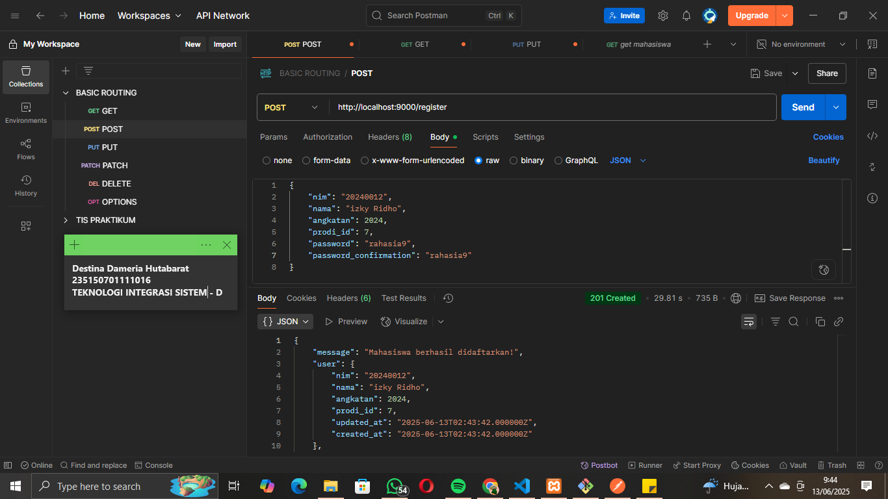
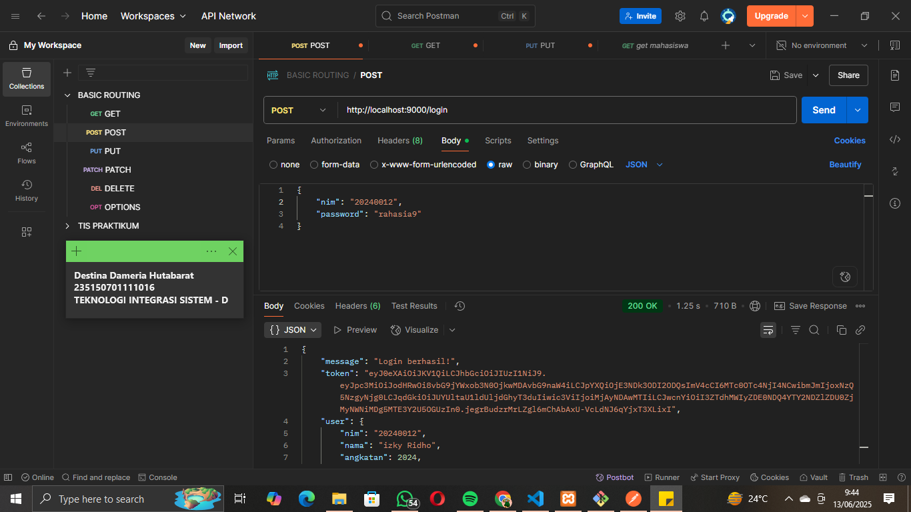
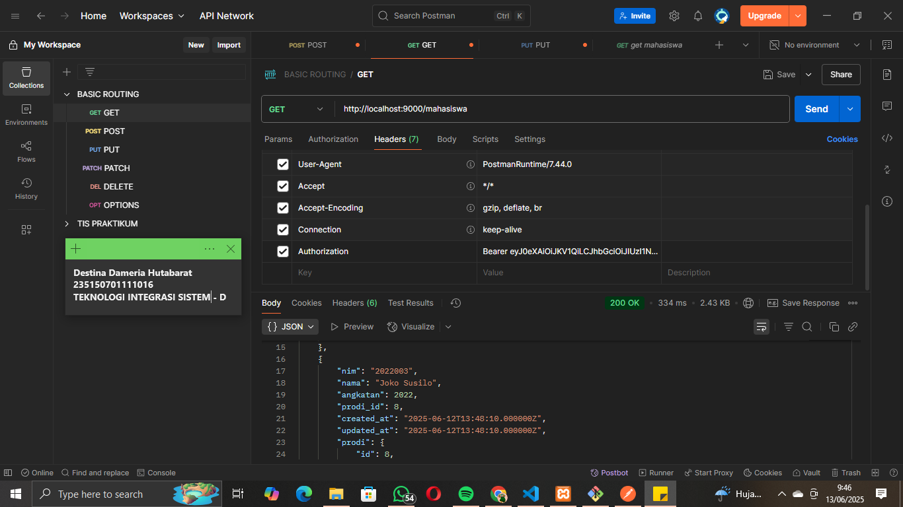
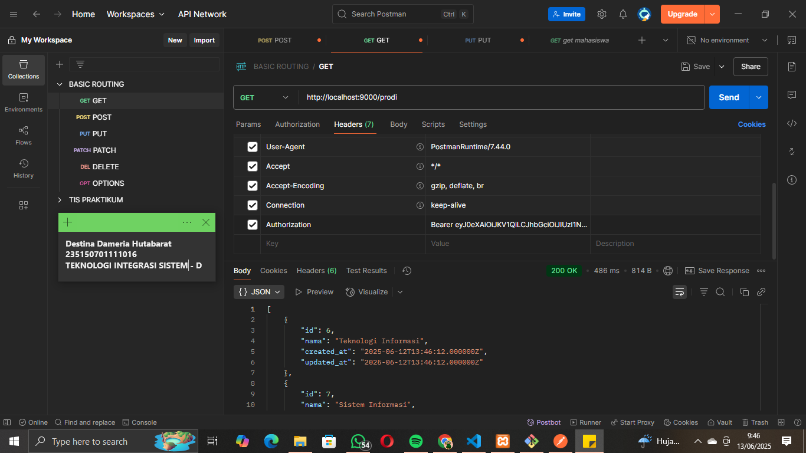
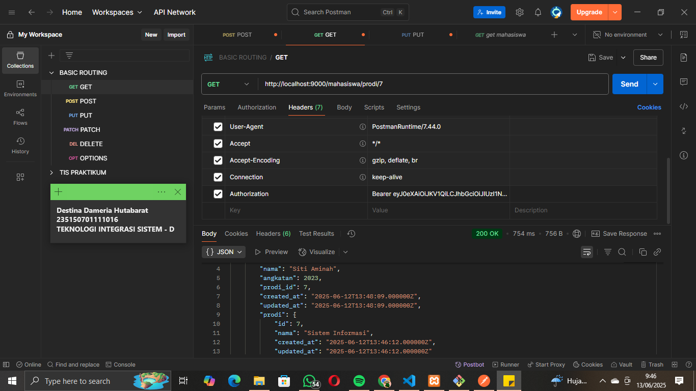
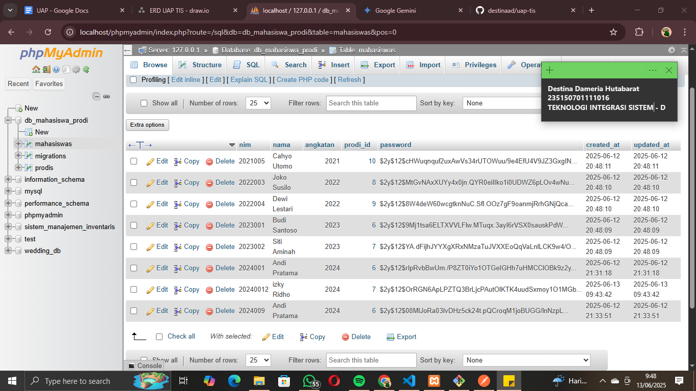
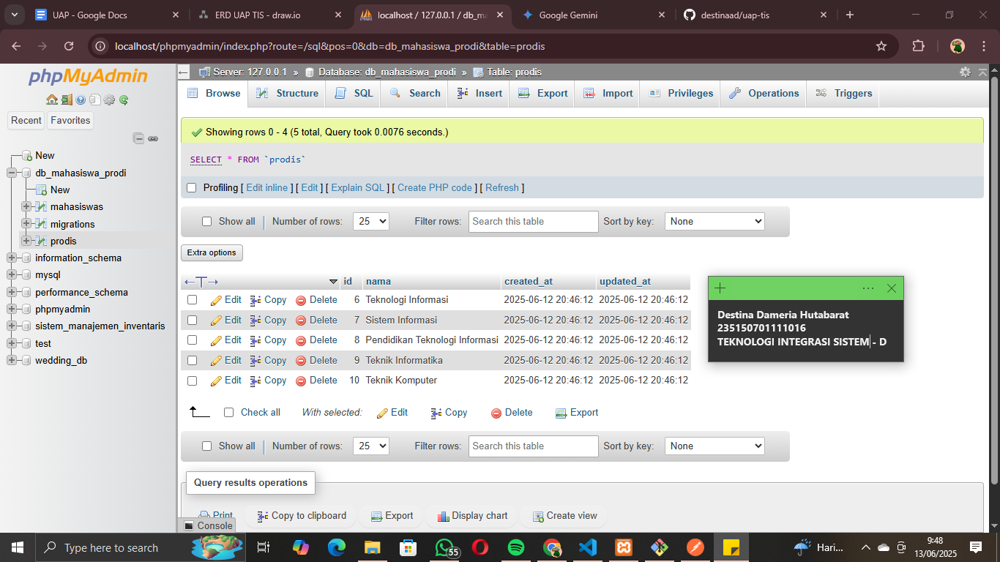

## ---------------------------------PROJECT UAP TEKNOLOGI INTEGRASI SISTEM---------------------------------- ##
## ------------------------------------TEMA MAHASISWA DAN PRODI (MEDIUM)---------------------------------- ##

                                        Nama: Destina Dameria Hutabarat
                                            NIM: 235150701111016

## Deskripsi Proyek

Proyek ini adalah implementasi *back-end* API sederhana untuk mengelola data mahasiswa dan program studi (prodi). API dibangun menggunakan Lumen Framework dan mengadopsi konsep autentikasi berbasis JWT (JSON Web Token) untuk mengamankan akses ke data.

## Fitur-fitur yang Tersedia

API ini menyediakan *endpoint* untuk beberapa operasi utama:

| HTTP Method | Endpoint                       | Deskripsi                                            | Perlu Autentikasi (JWT) |
| :---------- | :----------------------------- | :--------------------------------------------------- | :---------------------- |
| `POST`      | `/register`                    | Mendaftarkan mahasiswa baru ke sistem.               | ❌ Tidak                |
| `POST`      | `/login`                       | Melakukan login dan mendapatkan token autentikasi JWT. | ❌ Tidak                |
| `GET`       | `/mahasiswa`                   | Melihat semua daftar mahasiswa beserta informasi prodi mereka. | ✅ Ya                  |
| `GET`       | `/prodi`                       | Melihat semua daftar program studi yang tersedia.    | ✅ Ya                  |
| `GET`       | `/mahasiswa/prodi/{prodi_id}`  | Memfilter dan menampilkan daftar mahasiswa berdasarkan ID prodi tertentu. | ✅ Ya                  |
| `GET`       | `/me`                          | Melihat data detail user (mahasiswa) yang sedang login. | ✅ Ya                  |

## Struktur Database (ERD)

Proyek ini menggunakan dua tabel utama: `prodis` dan `mahasiswas`, dengan relasi **One-to-Many**:
* Satu Program Studi (`prodis`) dapat memiliki banyak Mahasiswa (`mahasiswas`).
* Satu Mahasiswa (`mahasiswas`) hanya dapat berada di satu Program Studi (`prodis`).

`mahasiswas.prodi_id` adalah *Foreign Key* yang merujuk ke `prodis.id`.



## Teknologi yang Digunakan

* Back-end Framework: [Lumen](https://lumen.laravel.com/)
* Bahasa Pemrograman: PHP
* Autentikasi: JWT (JSON Web Token) dengan library `tymon/jwt-auth`
* Database: MySQL (Sudah dikonfiurasi melaluli file `.env`)
* Web Server: PHP's built-in development server (untuk lokal)

## Cara Menjalankan Proyek (Setup Lokal)

### 1. Persiapan Software

* Instalasi XAMPP (Apache, MySQL, PHP) 
* Pastikan **Composer** sudah terinstal secara global
* Pastikan **Git** sudah terinstal
* VS Code sebagai *code editor* dan Postman untuk menguji API

### 2. Membuat Proyek & Instal Dependensi

1.  Buka git bash di folder htdocs
2.  Buat proyek Lumen baru:
    ```bash
    composer create-project --prefer-dist laravel/lumen uap-tis
    cd uap-tis # Masuk ke folder proyek yang baru dibuat
    cd . # Membuka folder ini langsung dari git bash untuk dibuka di vscode
    ```

### 3. Konfigurasi Lingkungan (`.env`)

1.  Buka file `.env` dan sesuaikan pengaturan database:
    ```dotenv
    DB_CONNECTION=mysql
    DB_HOST=127.0.0.1
    DB_PORT=3306
    DB_DATABASE=db_mahasiswa_prodi # Ini disesuaikan dengan nama database yang akan dibuat di XAMPP
    DB_USERNAME=root
    DB_PASSWORD= # Dikosongi aja
    ```
2.  Generate kunci JWT (Json Web Token):
    ```bash
    php artisan jwt:secret
    ```

### 4. Setup Database

1.  Pastikan MySQL di XAMPP Control Panel sudah berjalan.
2.  Buka phpMyAdmin di *browser* (`http://localhost/phpmyadmin`).
3.  Buat database baru dengan nama yang sesuai di `.env` yaitu db_mahasiswa_prodi
4.  Jalankan migrasi database untuk membuat tabel:
    ```bash php artisan migrate```
5.  Jalankan *seeder* untuk mengisi data *dummy* prodi dan mahasiswa:
    ```bash
    php artisan db:seed # Ini akan menjalankan DatabaseSeeder yang memanggil semua seeder
    ```
    *(Pastikan `ProdisTableSeeder` dan `MahasiswasTableSeeder` sudah benar dan terdaftar di `DatabaseSeeder.php`)*

### 5. Menjalankan Server API

1.  Buka terminal di vscode
2.  Jalankan server PHP development:
    ```bash
    php -S localhost:9000 -t public
    ```
3.  Jangan dihentikan (Ctrl + C) selama kita masih menguji API di postman

### 6. Pengujian API dengan Postman

Gunakan Postman untuk mengirim permintaan ke *endpoint* yang tersedia. 
1.  `POST` ke `http://localhost:9000/register` (untuk mendaftar user baru).
2.  `POST` ke `http://localhost:9000/login` (untuk mendapatkan JWT Token dari user yang sudah terdaftar/seeder).
3.  Gunakan Token tersebut di header `Authorization: Bearer <token>` untuk request selanjutnya:
    * `GET` `http://localhost:9000/mahasiswa`
    * `GET` `http://localhost:9000/prodi`
    * `GET` `http://localhost:9000/mahasiswa/prodi/{id_prodi}` (`http://localhost:9000/mahasiswa/prodi/7`)
    * `GET` `http://localhost:9000/me`

## Bukti Pengujian API

### 1. Register Mahasiswa (`POST /register`)
Memperlihatkan berhasilnya pendaftaran user baru dan perolehan token awal.


### 2. Login Mahasiswa (`POST /login`)
Memperlihatkan proses login user dan perolehan token autentikasi.


### 3. Melihat Semua Mahasiswa (`GET /mahasiswa`)
Menampilkan daftar mahasiswa lengkap dengan informasi prodi setelah autentikasi.


### 4. Melihat Semua Prodi (`GET /prodi`)
Menampilkan daftar semua program studi yang tersedia.


### 5. Filter Mahasiswa Berdasarkan Prodi (`GET /mahasiswa/prodi/{prodi_id}`)
Menampilkan daftar mahasiswa yang difilter berdasarkan ID prodi.


### 6. Database Tabel Mahasiswa 
Menampilkan tabel mahasiswas


### 7. Database Tabel Prodi
Menampilkan tabel prodis

---

## Kontribusi

Proyek ini dikerjakan secara mandiri oleh:

* Destina Dameria Hutabarat 
* 235150701111016
    * Bertanggung jawab penuh atas seluruh implementasi *back-end* API menggunakan Lumen.
    * Merancang dan mengimplementasikan struktur database (migrasi & seeder).
    * Mengimplementasikan sistem autentikasi Register dan Login menggunakan JWT.
    * Mengembangkan semua *endpoint* API sesuai spesifikasi tugas.
    * Membuat dokumentasi proyek ini (`README.md`) dan diagram ERD.

## Link Video Presentasi
https://drive.google.com/file/d/1kC3W0dQomet88_9AgTBh9hSqXnZH0jUc/view?usp=sharing
